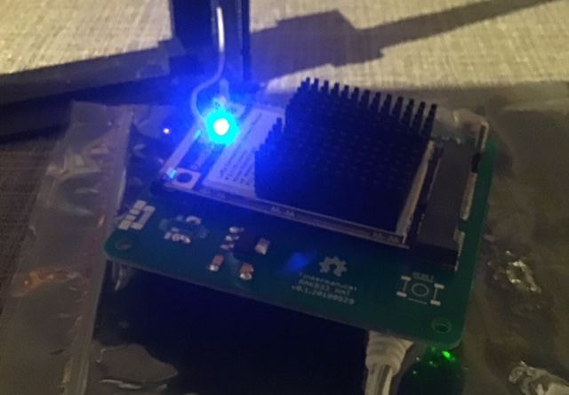

# Build your own Gateway
In this workshop we will build a gateway based on the RAK833-SPI and a Raspberry Pi Zero W.

Required parts:

- Raspberry Pi Zero W
- micro sdcard of at least 2GB
- power supply, 5V at least 2.5A with micro USB connector
- PCB from https://github.com/xoseperez/rak833-hat/tree/master/pcb with parts (see link for part numbers):

        - ams1117-3v3
        - 10uF 6.3V Tantalum Capacitors
        - Molex MiniPCI-E connector and latch
        - 20x2 2.54 pitch female header (to connect to RPi)

- RAK833 SPI only model (search aliexpress.com and make sure to buy from RAK, other vendors charge a heafty markup)
- Antenna
- pigtail
- heatsink

## Populate the PCB
Solder the MiniPCI-E connector and latch onto the PCB. Mount the capacitors (marking towards the middle of the board) and the ams1117-3v3. Create solder jumpers to connect the RPI side pads of the switch footprint to the middle pads. (See the solder blobs to the left of the ams1117-3v3 in the picture below). The switches and USB connector are not populated as they serve no purpose for the SPI only model of the RAK833.



<span style="color:red">**NOTE:** Never power on the gateway without the antenna connected</span>

## Preparations
The workshop requires some tools to be available on you system. Check the list below and
follow the link to the installation instructions if you do not have the tool installed.

* For Windows and OSX: Etcher, SDcard writing software. [windows](etcher-windows.md), [OSX](etcher-osx.md)
* For Windows PuTTY

## Download the Operating System
The Raspberry Pi Zero W requires an operating system to be able to run the LoRaWAN software. Go to https://www.raspberrypi.org/downloads/raspbian/ to download the software. On the page choose 'Raspbian Stretch Lite'.
After download extract the ISO file from the archive.

## Write image to SDcard
Get the micro sdcard from the packaging. Insert it into the sdcard writer (use a sdcard adapter if required).

Windows & OSX:
Open Etcher, click "Select image" and browse to the ISO file extracted in the previous step, verify the correct SDcard is choosen.


Once the right file and device have been click 'Flash!'. (On Windows this will show the UAC dialog, click 'Yes')

Wait while Etcher is writing the image, after it is finished eject the SDcard and reinsert it to get access to the partition named 'boot'.

## Configure the SDcard for first boot
On the 'boot' partition add an empty file named 'ssh' (no extension).

Also create a file wpa_supplicant.conf with contents:
```
country=NL
ctrl_interface=DIR=/var/run/wpa_supplicant GROUP=netdev
update_config=1
network={
        ssid="Workshop"
        psk="Maakplek2018"
        key_mgmt=WPA-PSK
}
```
Eject the sdcard from your system.

## Boot the RPi Zero W
Make sure no one else is booting a Raspberry Pi Zero W at the same time. (Both will have the same name when requesting an IP address making it hard to determine which is which)

Plug the sdcard into the RPi Zero W and connect the power supply to the outer (most towards the edge of the RPi) micro USB connector to boot.
**Do not connect additional hardware yet.**

1. Find your IP address in the DHCP list of the router.
1. Open (OSX) Terminal or (Windows) PuTTY
1. Log in using username 'pi' and password 'raspberry'
1. run ```passwd``` and enter a new password to secure access to your RPi
1. Run configuration tool (```sudo raspi-config```) to extend FS (Advanced Options, A1), enable SPI (Interfacing options P4, select 'Yes') and set the hostname (Network Options, N1, set the name to something unique)
1. Exit the configuration tool and reboot when asked.

## Add the gateway to the TTN console
Now we need to add your gateway in the TTN console.

1. Use your TTN credentials to log in to https://console.thethingsnetwork.org/
1. In the main screen click on gateways

1. Click on "register gateway" (or "Get started by registering one")

1. In the form enter the following values:
<table>
<tr><th>Name</th><th>Value</th></tr>
<tr><td>Gateway ID</td><td>unique name for the gateway, allowed A-Z, a-z, 0-9 and -</td></tr>
<tr><td>legacy packet forwarder</td><td>do <b>not</b> check this</td></tr>
<tr><td>Description</td><td>Human read-able description</td></tr>
<tr><td>Frequency Plan</td><td>Europe 868MHz</td></tr>
<tr><td>Router</td><td>ttn-router-eu</td></td>
<tr><td>Location</td><td>do <b>not</b> set a location at the workshop, do this once the gateway is located where it will be used</td></tr>
<tr><td>Antenna Placement</td><td>Indoor</td></tr>
</table>


Click "Register Gateway" to proceed.

The result should look like:


Keep this window open, you need it to copy-and-paste information

## Installing the required LoRaWAN software
Check the router for your RPi, it should now be listed with the unique name you gave it previously.

To forgo the twenty minute build process a prebuild binary package is available. Log on to the RPi and issue the next commands:
```
cd /tmp
wget http://office.the-box.com/mp-pkt-fwd-3.0.23.armhf.deb
sudo apt-get install -f /tmp/mp-pkt-fwd-3.0.23.armhf.deb
```

## Configure your device
Go to /opt/ttn-gateway and create a file called 'credentials.sh' (minus the quotes) using the command:
```
cd /opt/ttn-gateway
sudo nano credentials.sh
```

In the file enter:
```
export GW_ID="<the gateway ID listed on the overview page>"
export GW_KEY="<value from console, read the next paragraph on how to get it>"
```
To get the key value in the TTN console click on the little eye icon to the right of "Gateway Key", this will display the value. Now use the icon at the end of the line to copy the value (and display "copied")

Save the file with Control-O and exit the editor with Control-X.
Set the file to be executable

```
sudo chmod 755 credentials.sh
```

Shutdown the RPi with
```
sudo shutdown -h now
```
Wait until the green light dims and remove the power plug from the 'wall' socket. Remove the power plug from the RPi as well.

## Adding the concentrator hardware
Plug the carrier board on top of the RPi. Now carefully remove the concentrator board from the anti static packaging and add it to the carrier board. The board should click into place easily, **do not force it**.
Next screw the antenna onto the pigtail wire and connect the u.fl connector to the u.fl connector on the concentrator board. Make sure the connectors fit together well. Ask for a second opinion if not sure.

Reconnect the power supply and power on the RPi. Wait 2 minutes for it to boot and log in.

## Starting the packet forwarder
To start the software for the first time, run
```
systemctl start ttn-gateway.service
journalctl -xfn
```

The second command will provide output of all running system jobs, if the software is running correctly you should see output like:
```
Sep 24 21:38:34 rak833pi run-lorawan.sh[607]: 21:38:34  INFO: Flush output after statistic is disabled
Sep 24 21:38:34 rak833pi run-lorawan.sh[607]: 21:38:34  INFO: Flush after each line of output is disabled
Sep 24 21:38:34 rak833pi run-lorawan.sh[607]: 21:38:34  INFO: Watchdog is disabled
Sep 24 21:38:34 rak833pi run-lorawan.sh[607]: 21:38:34  INFO: Contact email configured to ""
Sep 24 21:38:34 rak833pi run-lorawan.sh[607]: 21:38:34  INFO: Description configured to "RAK833 Workshop gateway"
Sep 24 21:38:34 rak833pi run-lorawan.sh[607]: 21:38:34  INFO: [Transports] Initializing protocol for 1 servers
Sep 24 21:38:34 rak833pi run-lorawan.sh[607]: 21:38:34  INFO: [TTN] server "bridge.eu.thethings.network" connected
Sep 24 21:38:34 rak833pi run-lorawan.sh[607]: 21:38:34  INFO: [main] Starting the concentrator
**Sep 24 21:38:37 rak833pi run-lorawan.sh[607]: 21:38:37  INFO: [main] concentrator started, radio packets can now be received.**
Sep 24 21:38:37 rak833pi run-lorawan.sh[607]: 21:38:37  INFO: Disabling GPS mode for concentrator's counter...
Sep 24 21:38:37 rak833pi run-lorawan.sh[607]: 21:38:37  INFO: JIT thread activated.
Sep 24 21:38:37 rak833pi run-lorawan.sh[607]: 21:38:37  INFO: host/sx1301 time offset=(1537832314s:726508µs) - drift=2094524524µs
Sep 24 21:38:37 rak833pi run-lorawan.sh[607]: 21:38:37  INFO: Enabling GPS mode for concentrator's counter.
```

If the output lists 'Failed to start concentrator' the hardware is not detected. This might have several causes. Power down the RPi with 'sudo shutdown -h', remove the power and check if everything has been connected correctly.

## Check the gateway is active
In the TTN console switch to "Traffic". If there are any nodes nearby sending data, packets will show


## Start packet forwarder at system startup
To start the packet forwarder each time the RPi is booted issue the following command:
```
sudo systemctl enable ttn-gateway.service
```

<span style="color: green; font-size: 20pt">Congratulations, the gateway is now operational!</span>

## Reconfiguring the gateway for another WiFi network
To reconfigure the gateway for another WiFi network you can repeat the steps used to connect to the workshop network.